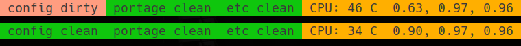
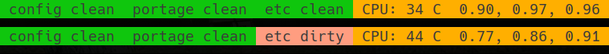
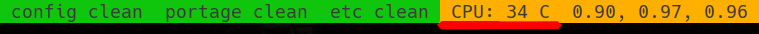

# Description
This is a collection of scripts to be used with tmux, i3-gaps and i3blocks.

i3blocks looks like this:


# Dependencies
* `app-emulation/libvirt` for `vm_status`
* `sys-apps/lm-sensors` for `cpu`
* `x11-misc/xkblayout-state` for `current_language`
* `media-sound/pulsemixer` for `volume`
* `media-sound/pavucontrol` for `volume`
* [`app-misc/headsetcontrol`](https://github.com/Sapd/HeadsetControl)[::nitratesky](https://github.com/SabbathHex/nitratesky) for `headset_ctl`
* `x11-misc/j4-dmenu-desktop` for the launcher
* `media-gfx/maim` for `scrnsht_ctl`
* `x11-misc/xvkbd` for `noctrlq.sh` and `ctrlshiftc.sh`
* `app-misc/tmux` for tmux helpers
* `sys-apps/etckeeper` for monitoring `/etc/` repository
* `x11-misc/dunst` for notifications

# Installation

There is an [ebuild](https://github.com/SabbathHex/nitratesky/blob/master/x11-misc/SH-wm-scripts/SH-wm-scripts-9999.ebuild) available in nitratesky overlay. Alternatively, the scripts may be downloaded and used on their own.

# Structure
## i3-helpers

* `j4-launcher.sh` — `j4-dmenu-desktop`-based launcher, capable of filtering out unneeded desktop files
* `ctrlshiftc.sh` — catches `Ctrl+Shift+c` when sent to Firefox and resends normal `Ctrl+c`
* `noctrlq.sh` — stops Firefox from exiting when `Ctrl+q` is pressed
* `scrnsht_ctl` — small utility to capture screenshots. By default uses darken shader to darken the rest of the screen
* `toggle_gaps.sh` — script to toggle gaps on the current workspace, requires `i3-gaps`
* `layout_toggle.sh` — script that toggles keyboard layouts, sends notification using `dunstify` and changes keyboard layouts in specified Xephyrs running inside firejails. Requires running Xephyrs to have the same set of keyboard layouts as the host xorg-server in the same order.
* `toggle_output_focus.sh` — script to toggle focus between multiple outputs supplied to its parameters.

    Example binding:

    ```
    bindsym $mod+Escape exec --no-startup-id $helper_path/toggle_output_focus.sh DP-0 DVI-D-0
    ```

* `move_ws_to_output.sh` — script to move workspace to the next output and focus that output.

    Example binding:

    ```
    bindsym $mod+Shift+Tab exec --no-startup-id $helper_path/move_ws_to_output.sh DP-0 DVI-D-0
    ```

## i3blocks
* `battery` — displays battery status. Requires battery number as the argument
* `clock` — the clock
* `cpu_temp` — cpu temp, requires an argument (see below)
* `config_repo_status` — I keep my `${HOME}/.config` as a git repository and if something is changed there and is not commited, this block appears on i3blocks bar. If clicked, it opens up `$TERMINAL` at the repo location.
* `current_language` — shows the current language using `xkblayout-state`
* `headset_ctl` — shows battery status for [compatible headphones](https://github.com/Sapd/HeadsetControl).
* `internet` — shows WiFi signal strength
* `todo_next` — block for the next item in [vim todolist](https://github.com/SabbathHex/vim-todofile).
* `todo_total` — block for the total amount of items in [vim todolist](https://github.com/SabbathHex/vim-todofile).
* `vm_status` — uses `virsh` to check if VM from the argument is running
* `volume` — shows volume level and can launch `pulsemixer` and `pavucontrol`

### `cpu_temp`
cpu: requires an argument in `jq` compatible format. E.g. for the following output:
```
{
   "k10temp-pci-00c3":{
      "Adapter": "PCI adapter",
      "Tdie":{
         "temp1_input": 37.500,
         "temp1_max": 70.000
      },
      "Tctl":{
         "temp2_input": 37.500
      }
   }
}
```
the argument should be `'."k10temp-pci-00c3"."Tdie"."temp1_input" | round'` to produce output `38 C`

## Tmux

* `config-status.sh` — provides a widget that can tell if `${HOME}/.config` repository has uncommited changes
    

* `etckeeper-status.sh` — provides a tmux widget that can tell if the `/etc` directory has uncommited changes
    

* `sensor.sh` — provides CPU temperature, see `cpu_temp` above. `tmux.conf` makes it a little hard to escape parameters properly, so this is best used in a wrapper script
    

* `uptime.sh` — provide `uptime` output
    

Portage clean is based on `config-status.sh` and checks the state of `/etc/portage` repository
